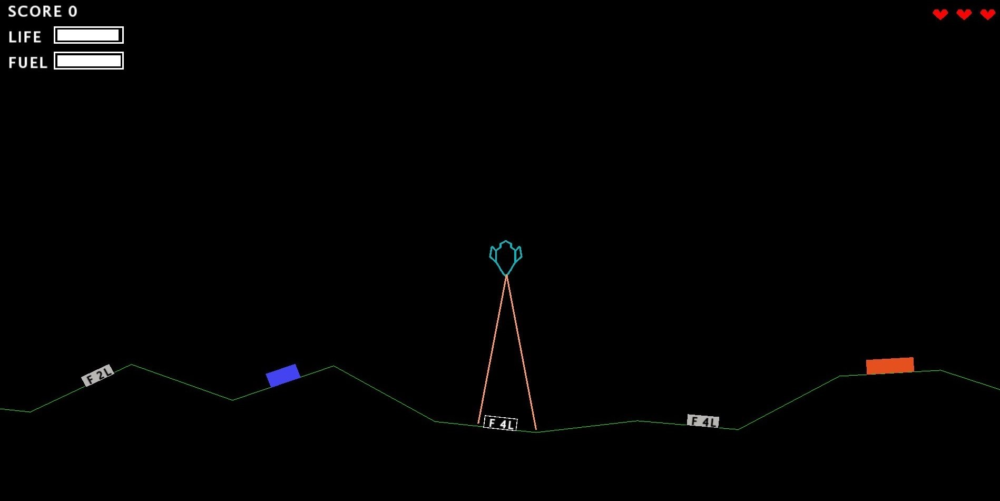

# No-Gravitar


---

### Table of Contents

- [Description](#description)
- [Gameplay](#gameplay)
- [Dependencies](#dependencies)
- [Installation](#installation)
- [Author Info](#author-info)

---

## Description

No Gravitar is a spaceship game for PC. The main difference with *Gravitar (Atari, 1982)* is that in this one ther is no gravity at all. 
(Gravitar live demo at [link](https://my.ign.com/atari/gravitar)).
The player controls a little spaceship and moves with it through different solar systems and planets. On each planet, there are multiple bunkers: in order to conquer the planet the user has to destroy them all. Once all the planets are destroyed, the solar system is conquered and the game moves to the next one.
The player must be careful to not get himself shot and to not run out of fuel.   
For our game we have chosen a minimalist graphic design given by simple geometric shapes, in line with the original game.

## Gameplay

The player can use left and right arrows to rotate, while up and down arrows allow the user to move in the chosen direction. Up arrow also allows to speed up. 
To land on a planet is sufficient to pass over it with the spacecraft. Space bar is for shoting while tab key is for activate tractor beam that allows you to collect fuel.

 
[Back To The Top](#No-Gravitar)


---

## Dependencies

This project has been fully written in C++ language, using SFML library. For more about SFML click [here](https://www.sfml-dev.org/).

## Installation

### Linux
```
sudo apt-get install g++
sudo apt-get install libsfml-dev
git clone https://github.com/erikalena/No-Gravitar.git
# find the project directory 
cd code
make
./game
```

### Windows
```
git clone https://github.com/erikalena/No-Gravitar.git
# find the project directory 
cd windows
# open file NonGravitar.exe
```

## Author Info

This project has been developed as part of 'Programming' course at the University of Bologna;<br>
all the code has been been written by: *Sofia Gavanelli*, *Erika Lena*, *Martina Ritrovato*.

Contact details:
- sofiagavanelli@gmail.com
- erika.lena@gmail.com
- martiross99@gmail.com

Please let us know if you have any further questions or any kind of issues.

[Back To The Top](#No-Gravitar)

|  |  |
|:---:|:---:|
